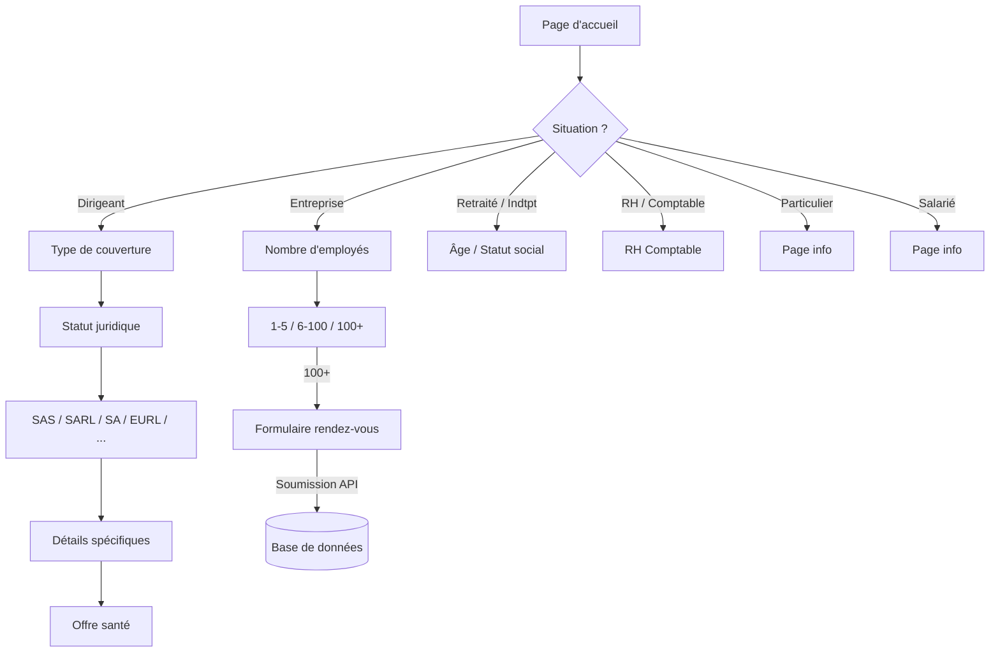

# Novéa Simulateur — Documentation Technique

## 📋 Vue d'ensemble

**Novéa Simulateur** est un simulateur multi-étapes de mutuelle santé développé en **Next.js 16 (App Router)** avec **React 19**, **TypeScript** et **Tailwind CSS**.

Le projet permet aux utilisateurs de parcourir un arbre de décisions (situation professionnelle → statut juridique → couverture → offre santé) et de soumettre leurs données de simulation pour un suivi commercial ultérieur.

---

## 🏗 Architecture du projet

```
novea-simulator/
├── src/
│   ├── app/                          # Pages (App Router)
│   │   ├── api/simulation/           # Endpoint API (POST uniquement)
│   │   │   └── route.ts
│   │   ├── company-status/           # Sélection du statut juridique
│   │   ├── coverage-type/            # Type de couverture
│   │   ├── dirigeant/                # Branche dirigeant
│   │   ├── employee-count/           # Nombre d'employés
│   │   ├── legal-form/               # Formes juridiques (SAS, SARL, SA, etc.)
│   │   ├── other-situations/         # RH, étudiant, salarié, etc.
│   │   ├── retraite-indtpt/          # Retraité / Indépendant
│   │   ├── salary-employees/         # Branche salariés
│   │   │   ├── convention-collective/
│   │   │   ├── count/
│   │   │   ├── health-offer/
│   │   │   ├── very-large/           # Formulaire final (100+ employés)
│   │   │   └── ...
│   │   ├── layout.tsx                # Layout racine + FormProvider
│   │   ├── page.tsx                  # Page d'accueil du simulateur
│   │   └── globals.css
│   ├── components/                   # Composants réutilisables
│   │   ├── ui/                       # Système de design (boutons, grilles, etc.)
│   │   ├── Icons.tsx                 # Bibliothèque d'icônes SVG
│   │   ├── OptionCard.tsx
│   │   └── PageTemplate.tsx
│   ├── contexts/
│   │   └── FormContext.tsx           # État global du formulaire + session_id
│   ├── lib/
│   │   ├── supabase.ts              # Client Supabase (clé publique)
│   │   └── submitSimulation.ts      # Helper de soumission côté client
│   └── utils/
│       ├── navigationFlow.ts        # Logique de routage entre les étapes
│       └── validation.ts            # Regex + sanitisation XSS
├── supabase/
│   └── migrations/
│       ├── 001_create_simulations.sql   # Création de la table
│       └── 002_unique_session_id.sql    # Contrainte UNIQUE
├── scripts/
│   └── test-rls-security.ts         # Tests de sécurité RLS
├── .env.local                        # Credentials Supabase (non versionné)
├── .env.local.example                # Template des variables d'environnement
└── package.json
```

---

## 🔄 Flux de navigation

L'utilisateur commence par choisir sa situation sur la page d'accueil. Chaque choix mène à une branche différente de l'arbre de décisions :



La logique de routage est centralisée dans `src/utils/navigationFlow.ts` via la fonction `getNextRoute()`.

---

## 🗄 Base de données

### Supabase (PostgreSQL)

**Table : `simulations`**

| Colonne                 | Type        | Contrainte       | Description                                     |
| ----------------------- | ----------- | ---------------- | ----------------------------------------------- |
| `id`                    | uuid        | PK, auto-généré  | Identifiant unique                              |
| `session_id`            | text        | NOT NULL, UNIQUE | ID de session du simulateur                     |
| `scenario_type`         | text        | —                | Situation choisie (dirigeant, entreprise, etc.) |
| `company_name`          | text        | —                | Nom de l'entreprise                             |
| `employees_count`       | integer     | —                | Nombre de collaborateurs                        |
| `convention_collective` | text        | —                | Convention collective                           |
| `email`                 | text        | —                | Email professionnel                             |
| `phone`                 | text        | —                | Téléphone                                       |
| `selected_offer`        | text        | —                | Offre santé sélectionnée                        |
| `form_message`          | text        | —                | Message libre                                   |
| `status`                | text        | DEFAULT 'new'    | Statut de la simulation                         |
| `created_at`            | timestamptz | DEFAULT now()    | Date de création                                |

**Index :** `idx_simulations_created_at` sur `created_at DESC`

### Migrations SQL

Les fichiers SQL se trouvent dans `supabase/migrations/` et doivent être exécutés dans l'éditeur SQL de Supabase :

1. `001_create_simulations.sql` — Crée la table, active RLS, crée la politique d'insertion
2. `002_unique_session_id.sql` — Ajoute la contrainte UNIQUE sur `session_id`

---

## 🔐 Sécurité

### Row Level Security (RLS)

| Opération  | Rôle `anon` | Résultat                |
| ---------- | ----------- | ----------------------- |
| **INSERT** | ✅ Autorisé | Seule opération permise |
| **SELECT** | ❌ Bloqué   | Retourne 0 lignes       |
| **UPDATE** | ❌ Bloqué   | 0 lignes affectées      |
| **DELETE** | ❌ Bloqué   | 0 lignes affectées      |

> Seul un administrateur avec la **service role key** peut lire, modifier ou supprimer les données.

### Protection de l'API (`/api/simulation`)

| Protection            | Détail                                           |
| --------------------- | ------------------------------------------------ |
| **Méthode**           | POST uniquement (pas de GET/PUT/DELETE)          |
| **Taille du payload** | Rejeté si > 5 KB (code 413)                      |
| **Champs requis**     | `session_id` et `email` obligatoires             |
| **Validation email**  | Regex côté serveur                               |
| **Troncature**        | Tous les champs sont tronqués avant insertion    |
| **Doublon**           | Contrainte UNIQUE sur `session_id` → erreur 409  |
| **Erreurs**           | Jamais d'erreur Supabase brute exposée au client |

### Limites de longueur par champ

| Champ                   | Max caractères |
| ----------------------- | -------------- |
| `session_id`            | 100            |
| `scenario_type`         | 100            |
| `company_name`          | 255            |
| `convention_collective` | 200            |
| `email`                 | 255            |
| `phone`                 | 50             |
| `selected_offer`        | 100            |
| `form_message`          | 1 000          |

### Protection XSS (côté client)

Le fichier `src/utils/validation.ts` fournit :

- `sanitizeInput()` — supprime les balises HTML, les scripts, les handlers d'événements
- `escapeHtml()` — échappe les caractères spéciaux HTML
- Validation par regex : téléphone, email, code postal, âge, nom, entreprise

### Variables d'environnement

```
NEXT_PUBLIC_SUPABASE_URL          → URL du projet Supabase
NEXT_PUBLIC_SUPABASE_PUBLISHABLE_DEFAULT_KEY  → Clé publique (anon)
```

> ⚠️ La clé de service (`service_role_key`) n'est **jamais** utilisée côté client.

---

## 📡 API

### `POST /api/simulation`

**Corps de la requête (JSON) :**

```json
{
  "session_id": "uuid-de-session",
  "email": "contact@example.com",
  "scenario_type": "dirigeant",
  "company_name": "Mon Entreprise",
  "employees_count": 50,
  "convention_collective": "Syntec",
  "phone": "01 23 45 67 89",
  "selected_offer": "confort",
  "form_message": "Message optionnel"
}
```

**Réponses :**

| Code | Corps                                                           | Cas                        |
| ---- | --------------------------------------------------------------- | -------------------------- |
| 200  | `{ "success": true }`                                           | Insertion réussie          |
| 400  | `{ "success": false, "error": "..." }`                          | Champ manquant ou invalide |
| 409  | `{ "success": false, "error": "Simulation already submitted" }` | Session déjà soumise       |
| 413  | `{ "success": false, "error": "Payload too large" }`            | Body > 5 KB                |
| 500  | `{ "success": false, "error": "Failed to save simulation" }`    | Erreur serveur             |

---

## 🧠 Gestion de session

- Un `session_id` est généré via `crypto.randomUUID()` dans le `FormContext`
- Il persiste pendant toute la durée de la session du simulateur
- Il est réinitialisé lorsque `resetFormData()` est appelé
- Il est envoyé avec les données lors de la soumission finale
- La contrainte UNIQUE empêche les doubles soumissions

---

## 🧪 Tests de sécurité

Un script de test automatisé vérifie que les politiques RLS sont correctement configurées :

```bash
npx tsx --env-file=.env.local scripts/test-rls-security.ts
```

**Tests exécutés :**

1. ✅ INSERT autorisé (sans retour de données)
2. ✅ SELECT bloqué (0 lignes retournées)
3. ✅ UPDATE bloqué (0 lignes affectées)
4. ✅ DELETE bloqué (0 lignes affectées)
5. ✅ UPSERT + SELECT bloqué

---

## 🚀 Démarrage rapide

```bash
# 1. Installer les dépendances
npm install

# 2. Configurer les variables d'environnement
cp .env.local.example .env.local
# Remplir avec vos credentials Supabase

# 3. Exécuter les migrations SQL dans l'éditeur Supabase
# → supabase/migrations/001_create_simulations.sql
# → supabase/migrations/002_unique_session_id.sql

# 4. Lancer le serveur de développement
npm run dev

# 5. Vérifier la sécurité RLS
npx tsx --env-file=.env.local scripts/test-rls-security.ts
```

---

## 📦 Dépendances principales

| Package                 | Version | Rôle                |
| ----------------------- | ------- | ------------------- |
| `next`                  | ^16.1.3 | Framework React SSR |
| `react`                 | ^19.2.3 | Bibliothèque UI     |
| `@supabase/supabase-js` | latest  | Client Supabase     |
| `tailwindcss`           | ^4.1.18 | Styles utilitaires  |
| `typescript`            | ^5.9.3  | Typage statique     |

---

## 🔮 Évolutions futures (Phase 2+)

- [ ] Dashboard administrateur (lecture des simulations)
- [ ] Authentification admin (Supabase Auth)
- [ ] Rate limiting sur l'endpoint API
- [ ] CAPTCHA (Turnstile/reCAPTCHA) avant soumission
- [ ] Notifications email automatiques
- [ ] Intégration CRM
- [ ] Pages finales `/offer-setup/*` et `/offer` avec soumission
